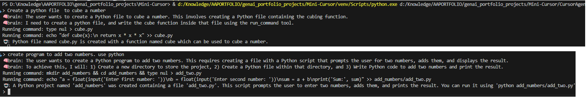

# Coding Assistant Project

## Project Description

This project is a coding-focused AI assistant designed to help users solve programming problems and answer coding-related queries. The assistant follows a structured, step-by-step process—**Start, Plan, Action, Observe, and Output**—to ensure clear and logical problem-solving. It can execute terminal commands securely and provide detailed explanations for each step in the process.

## Features

- **Step-by-step problem solving:** The assistant breaks down tasks into clear steps for transparency and reproducibility.
- **Terminal command execution:** Uses a `run_command` tool to execute commands directly from user input.
- **Specialized for coding queries:** Only responds to programming and coding-related questions.
- **Extensible tool system:** Easily add more tools for additional functionalities.

## Table of Contents

- [Coding Assistant Project](#coding-assistant-project)
  - [Project Description](#project-description)
  - [Features](#features)
  - [Table of Contents](#table-of-contents)
  - [Setup Instructions](#setup-instructions)
  - [Usage](#usage)
  - [Available Tools](#available-tools)
  - [Contributing](#contributing)
  - [License](#license)

## Setup Instructions

1. **Clone the repository:**
   ```sh
   git clone https://github.com/amitguptaforwork/genai_portfolio_projects.git
   cd genai_portfolio_projects/Agent-Mini-Cursor
   ```
2. **Install dependencies:**
   ```sh
   pip install -r requirements.txt
   ```
3. **Set up environment variables:**
   - Create a `.env` file in the project root.  There is a .envSAMPLE file provided which can be used for the purpose.
   - Add your keys, Gemini and/or OpenAI.  
     ```
     GEMINI_API_KEY=your_google_api_key_here
     ```
   - Depending upon what you want to use (gemini or openai), modify these lines in CursorAgent.py
  ```python
   #Use this line to choose the LLM provider
   client, model = LLMFactory.getLLMClientAndModel("gemini")
   #client, model = LLMFactory.getLLMClientAndModel("openai")
   ```
## Usage

- Run the main script:
  ```sh
  python CursorAgent.py
  ```
- Enter your coding-related queries at the prompt.
- The assistant will:
  - Plan a solution,
  - Select and execute the appropriate tool,
  - Observe the results,
  - Output a clear, step-by-step response.

**Example Interaction:**
```
> : Create a python file in the current directory with a function named sum which can be used to add two numbers.
🧠 ...  {"step": "plan", "content": "..."}
🤖 :  {"step": "output", "content": "Python file is created with a function named sum which can be used to add two numbers."}
```

## Available Tools

| Tool Name      | Description                                                        |
|----------------|--------------------------------------------------------------------|
| run_command    | Executes a given terminal command and returns the output/result.    |

## Contributing

Pull requests are welcome! 

## License

Specify your license here (e.g., MIT, Apache 2.0, GPL). Add a `LICENSE` file to the repository for details.

---


