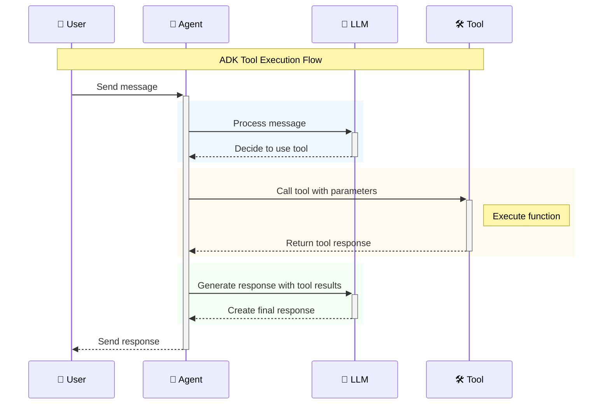
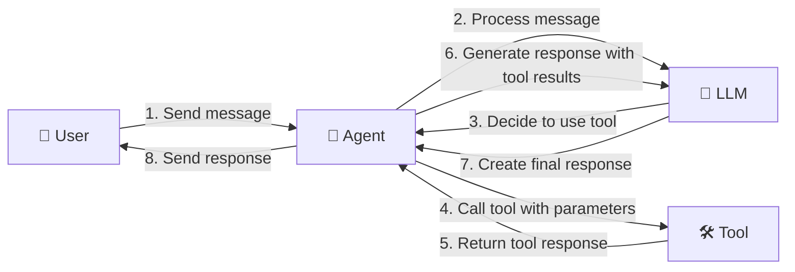
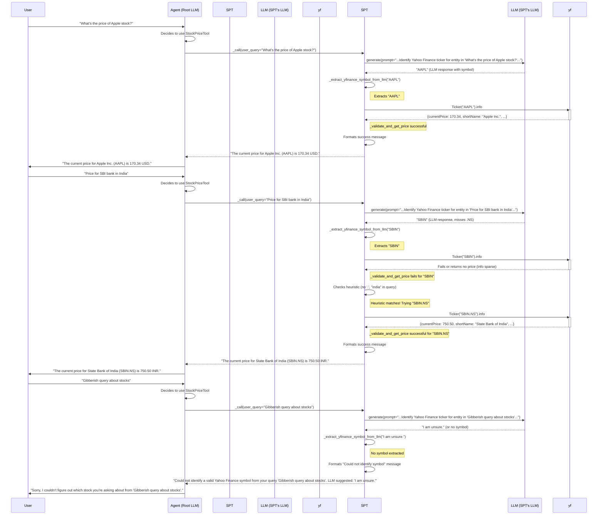

```mermaid
sequenceDiagram
    participant User as 👤 User
    participant Agent as 🤖 Agent
    participant LLM as 🧠 LLM
    participant Tool as 🛠️ Tool

    Note over User,Tool: ADK Tool Execution Flow

    User ->>+ Agent: Send message
    
    rect rgb(240, 248, 255)
        Agent ->>+ LLM: Process message
        LLM -->>- Agent: Decide to use tool
    end
    
    rect rgb(255, 250, 240)
        Agent ->>+ Tool: Call tool with parameters
        Note right of Tool: Execute function
        Tool -->>- Agent: Return tool response
    end
    
    rect rgb(245, 255, 245)
        Agent ->>+ LLM: Generate response with tool results
        LLM -->>- Agent: Create final response
    end
    
    Agent -->>- User: Send response
   
```

```mermaid
flowchart LR
    User["👤 User"]
    Agent["🤖 Agent"]
    LLM["🧠 LLM"]
    Tool["🛠️ Tool"]
    
    User -->|"1. Send message"| Agent
    Agent -->|"2. Process message"| LLM
    LLM -->|"3. Decide to use tool"| Agent
    Agent -->|"4. Call tool with parameters"| Tool
    Tool -->|"5. Return tool response"| Agent
    Agent -->|"6. Generate response with tool results"| LLM
    LLM -->|"7. Create final response"| Agent
    Agent -->|"8. Send response"| User
```

```mermaid
sequenceDiagram
    participant User
    participant Agent (Root LLM)
    participant StockPriceTool as SPT
    participant ToolLLM as LLM (SPT's LLM)
    participant YahooFinance as yf

    User->>Agent (Root LLM): "What's the price of Apple stock?"
    Agent (Root LLM)->>Agent (Root LLM): Decides to use StockPriceTool
    Agent (Root LLM)->>SPT: _call(user_query="What's the price of Apple stock?")

    SPT->>LLM (SPT's LLM): generate(prompt="...Identify Yahoo Finance ticker for entity in 'What's the price of Apple stock?'...")
    LLM (SPT's LLM)-->>SPT: "AAPL" (LLM response with symbol)

    SPT->>SPT: _extract_yfinance_symbol_from_llm("AAPL")
    Note right of SPT: Extracts "AAPL"

    SPT->>yf: Ticker("AAPL").info
    activate yf
    yf-->>SPT: {currentPrice: 170.34, shortName: "Apple Inc.", ...}
    deactivate yf
    Note right of SPT: _validate_and_get_price successful

    SPT->>SPT: Formats success message
    SPT-->>Agent (Root LLM): "The current price for Apple Inc. (AAPL) is 170.34 USD."

    Agent (Root LLM)->>User: "The current price for Apple Inc. (AAPL) is 170.34 USD."

    %% --- Alternative Flow: Symbol not immediately validated, heuristic used ---
    User->>Agent (Root LLM): "Price for SBI bank in India"
    Agent (Root LLM)->>Agent (Root LLM): Decides to use StockPriceTool
    Agent (Root LLM)->>SPT: _call(user_query="Price for SBI bank in India")

    SPT->>LLM (SPT's LLM): generate(prompt="...Identify Yahoo Finance ticker for entity in 'Price for SBI bank in India'...")
    LLM (SPT's LLM)-->>SPT: "SBIN" (LLM response, misses .NS)

    SPT->>SPT: _extract_yfinance_symbol_from_llm("SBIN")
    Note right of SPT: Extracts "SBIN"

    SPT->>yf: Ticker("SBIN").info
    activate yf
    yf-->>SPT: Fails or returns no price (info sparse)
    deactivate yf
    Note right of SPT: _validate_and_get_price fails for "SBIN"

    SPT->>SPT: Checks heuristic (no '.', "india" in query)
    Note right of SPT: Heuristic matches! Trying "SBIN.NS"

    SPT->>yf: Ticker("SBIN.NS").info
    activate yf
    yf-->>SPT: {currentPrice: 750.50, shortName: "State Bank of India", ...}
    deactivate yf
    Note right of SPT: _validate_and_get_price successful for "SBIN.NS"

    SPT->>SPT: Formats success message
    SPT-->>Agent (Root LLM): "The current price for State Bank of India (SBIN.NS) is 750.50 INR."

    Agent (Root LLM)->>User: "The current price for State Bank of India (SBIN.NS) is 750.50 INR."

    %% --- Alternative Flow: LLM cannot identify symbol ---
    User->>Agent (Root LLM): "Gibberish query about stocks"
    Agent (Root LLM)->>Agent (Root LLM): Decides to use StockPriceTool
    Agent (Root LLM)->>SPT: _call(user_query="Gibberish query about stocks")

    SPT->>LLM (SPT's LLM): generate(prompt="...Identify Yahoo Finance ticker for entity in 'Gibberish query about stocks'...")
    LLM (SPT's LLM)-->>SPT: "I am unsure." (or no symbol)

    SPT->>SPT: _extract_yfinance_symbol_from_llm("I am unsure.")
    Note right of SPT: No symbol extracted

    SPT->>SPT: Formats "Could not identify symbol" message
    SPT-->>Agent (Root LLM): "Could not identify a valid Yahoo Finance symbol from your query 'Gibberish query about stocks'. LLM suggested: 'I am unsure.'"
    Agent (Root LLM)->>User: "Sorry, I couldn't figure out which stock you're asking about from 'Gibberish query about stocks'."
```