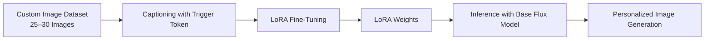
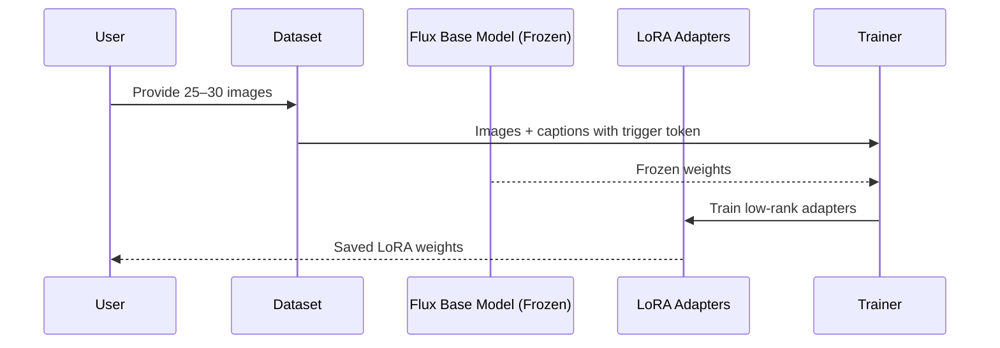

# 🎨 Personalized Image Generation using LoRA (PEFT) on Flux Diffusion Models

This project demonstrates a **proof-of-concept (PoC)** for **personalized image generation** by fine-tuning a **Flux.ai diffusion model** using **LoRA (Low-Rank Adaptation)**.
The model is adapted to generate images of a specific subject/style using only **25–30 training images**, without retraining the full model.

The project focuses on **parameter-efficient fine-tuning (PEFT)** to achieve high-quality, identity-consistent outputs with low compute cost.

---

## 🚀 Key Features

* Parameter-efficient fine-tuning using **LoRA (PEFT)**
* Works with **small custom datasets (25–30 images)**
* Base diffusion model remains **fully frozen**
* Modular inference via **dynamic LoRA weight loading**
* Built using **Hugging Face Diffusers + PyTorch**

---

## 🧠 High-Level Approach

Instead of fine-tuning all parameters of a large diffusion model, this project:

* Freezes the base **Flux diffusion model**
* Injects **LoRA adapters** into attention layers
* Trains only a small number of additional parameters

This allows efficient personalization while preserving the general capabilities of the base model.

---

## 📊 High-Level Workflow



---

## 🔧 Technical Training Flow



---

## 🗂️ Dataset Preparation

* Collected **25–30 high-quality images** of a single subject
* Ensured diversity in:

  * Camera angles
  * Lighting
  * Facial expressions / poses
* Captioned each image using a **unique trigger token**

**Example caption:**

```
photo of <my_person> wearing a black jacket, studio lighting
```

The trigger token (`<my_person>`) enables **subject-consistent generation** during inference.

---

## 🏋️ Fine-Tuning Methodology

* **Training type:** Supervised Fine-Tuning (SFT)
* **Fine-tuning strategy:** LoRA (PEFT)
* **Trainable parameters:** LoRA adapters only
* **Frozen components:** Entire base Flux diffusion model
* **Target layers:** Cross-attention and self-attention layers

This significantly reduces:

* GPU memory usage
* Training time
* Risk of catastrophic forgetting

---

## 💻 Sample Training Code (Hugging Face + PEFT)

```python
from diffusers import DiffusionPipeline
from peft import LoraConfig, get_peft_model
import torch

# Load base Flux diffusion model
pipeline = DiffusionPipeline.from_pretrained(
    "flux-ai/flux-base-model",
    torch_dtype=torch.float16
).to("cuda")

# Configure LoRA
lora_config = LoraConfig(
    r=16,
    lora_alpha=32,
    target_modules=["to_q", "to_k", "to_v"],
    lora_dropout=0.05,
    bias="none"
)

# Inject LoRA adapters
pipeline.unet = get_peft_model(pipeline.unet, lora_config)

# Freeze base model weights
for param in pipeline.unet.base_model.parameters():
    param.requires_grad = False

# Only LoRA params are trainable
pipeline.unet.print_trainable_parameters()
```

---

## 🧪 Evaluation Strategy

Model performance was evaluated qualitatively by comparing:

| Metric               | Base Model     | LoRA Fine-Tuned Model |
| -------------------- | -------------- | --------------------- |
| Identity Consistency | ❌ Generic      | ✅ Recognizable        |
| Style Preservation   | ❌ Inconsistent | ✅ Stable              |
| Prompt Adherence     | ⚠️ Partial     | ✅ Strong              |

Evaluation prompts included:

```
"cinematic portrait of <my_person>, dramatic lighting"
"photo of <my_person> in a professional studio setup"
```

---

## ⚡ Inference & Deployment

LoRA weights are loaded **dynamically at inference time**, enabling modular reuse of the base model.

```python
# Load LoRA weights for inference
pipeline.unet.load_adapter("lora_weights/my_person_lora")

prompt = "cinematic portrait of <my_person>, ultra realistic"
image = pipeline(prompt).images[0]

image.save("output.png")
```

### ✅ Benefits of Dynamic Loading

* Single base model → multiple personalizations
* Low storage overhead
* Fast switching between LoRA adapters

---

## 🧰 Tech Stack

* **Python**
* **PyTorch**
* **Hugging Face Diffusers**
* **PEFT (LoRA)**
* **Flux.ai Diffusion Model**

---

## 📌 Use Cases

* Personalized avatars
* Creative AI tools
* Style transfer
* Rapid prototyping for generative AI products

---

## 📈 Future Improvements

* Support for multiple LoRA adapters per prompt
* Quantized inference for faster deployment
* Automated evaluation metrics (CLIP similarity)
* Web-based demo for interactive prompting

---

## 🏁 Summary

This project showcases how **LoRA-based PEFT** enables efficient and scalable personalization of large diffusion models using minimal data and compute, making it suitable for real-world generative AI applications.

---

