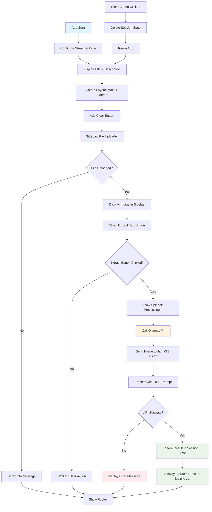
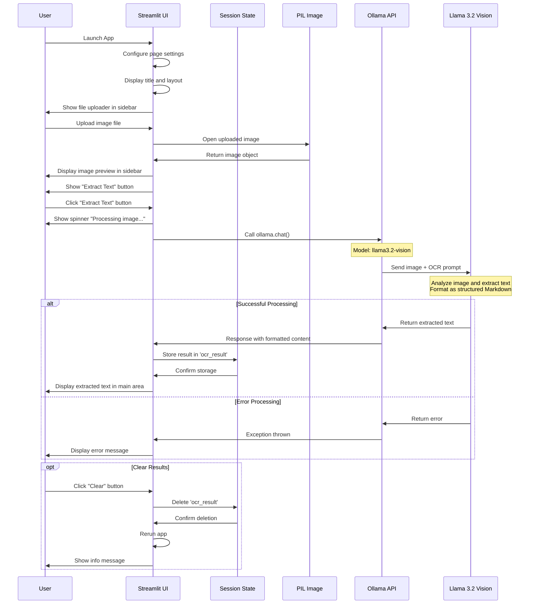

# LLama3.2-OCR

This project leverages Llama 3.2 vision and Streamlit to create a 100% locally running OCR app.  We can give any scanned image to the app and it will try to give us text out of it.  

Unlike traditional OCR software like Tesseract, this app utilizes the more powerful system - an LLM to do the same.  The results are much better in most cases.  Also the LLM is going to run locally in our system, thereby ensuring privacy as well as no charges !

## Installation and setup

**Setup Ollama**:
   1. Install Docker Desktop (on Windows)
   2. Install ollama image
   `docker pull ollama/ollama `
   
   3. Start ollama container. This can be easily done using docker desktop.  If you want to start from command line then use 
   `docker run -d --name ollama -p 11434:11434 ollama/ollama `
   4. Go to terminal in the ollama container
   
   5. Pull llama 3.2 vision model
   `ollama pull llama3.2-vision`
   
   6. You can see the models available
   


**Install Dependencies**:
   Ensure you have Python 3.11 or later installed.
   ```bash
   pip install streamlit ollama
   ```

**Architecture** 

### Flow Diagram ###

The flow diagram shows the complete application logic including:

- App initialization and page configuration
- Layout creation with sidebar and main area
- File upload handling
- Image processing workflow
- Ollama API integration
- Error handling
- Session state management
- Clear functionality 



### Sequence Diagram ###
The sequence diagram illustrates the interactions between different components:

- User interactions: File upload, button clicks
- Streamlit UI: Interface management and display
- Session State: Data persistence across interactions
- PIL: Image processing
- Ollama API: Communication with the vision model
- Llama 3.2 Vision: The actual OCR processing




---
