# OCR-LocalUsingOllama and Llama3.2 Vision Model

This project leverages Llama 3.2 vision and Streamlit to create a 100% locally running OCR app.  We can give any scanned image to the app and it will try to give us text out of it.  

Unlike traditional OCR software like Tesseract, this app utilizes the more powerful system - an LLM to do the same.  The results are much better in most cases.  Also the LLM is going to run locally in our system, thereby ensuring privacy as well as no charges !

Ofcourse, the hardware we have locally matters.  I tried this on a system with no GPU (AMD Ryzen 7 5700G with Radeon Graphics,3.80 GHz) and 32GB RAM. There is no GPU used (the inbuilt GPU in Ryzen 5700G is not available to us :(, most ML code is right now targeted to Nvidia gpus ). ❗**It is taking more than 15 minutes to process an image.❗**


Then I set it up on Google Colab Free tier that gives us 15GB GPU RAM, 12b GB System RAM and 112.6 GB Space.  
✅ **We got response in 45 seconds**

I have included steps in this file below explaining how to setup this code on Google Colab

Here is the app in action, running from colab
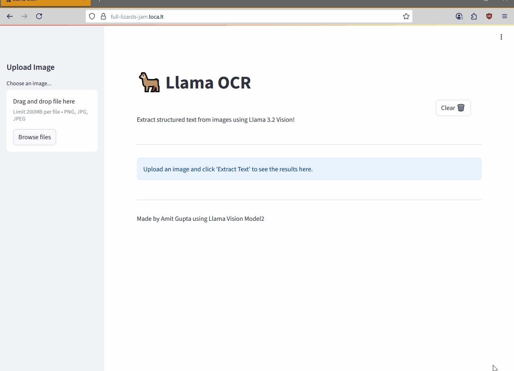


## Installation and setup on Local Machine

**Setup Ollama**:
   1. Install Docker Desktop (on Windows)
   2. Install ollama image
   `docker pull ollama/ollama `
   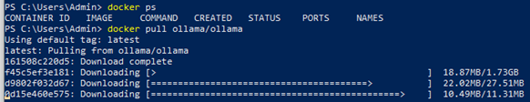
   3. Start ollama container. This can be easily done using docker desktop.  If you want to start from command line then use 
   `docker run -d --name ollama -p 11434:11434 ollama/ollama `
   4. Go to terminal in the ollama container
   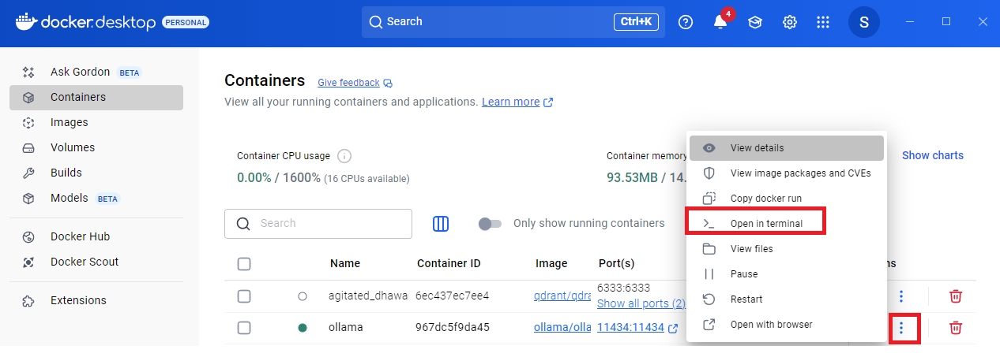
   5. Pull llama 3.2 vision model
   `ollama pull llama3.2-vision`
   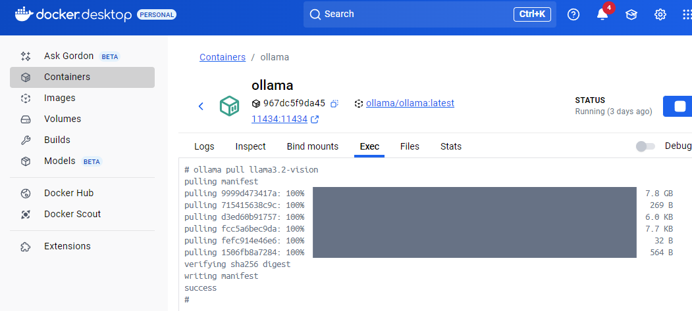
   6. You can see the models available
   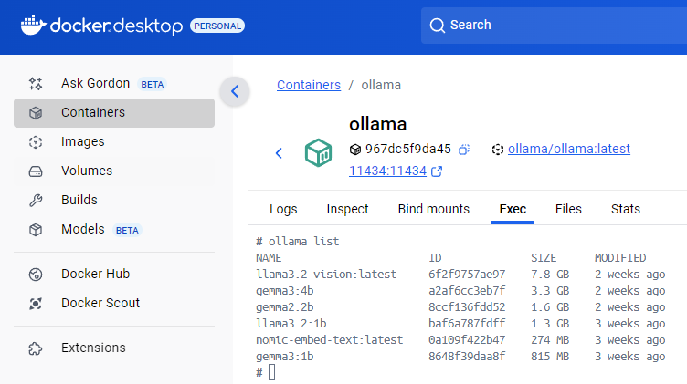


**Install Dependencies**:
   Ensure you have Python 3.11 or later installed.
   ```bash
   pip install streamlit ollama
   ```

**Run the app**:
`streamlit run app.py`
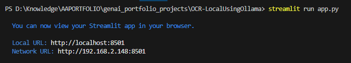


## Installation and setup on Google Colab + Ollama + Streamlit + LocalTunnel

This guide walks you through setting up Ollama with Llama 3.2 Vision model on Google Colab and running a Streamlit OCR application.

See this file for full code of Colab file

[👉 View the Jupyter Notebook](OCR_StreamlitOllamaLlama.ipynb)


[](https://colab.research.google.com/github/amitguptaforwork/genai_portfolio_projects/blob/master/OCR-LocalUsingOllama/OCR_StreamlitOllamaLlama.ipynb)


## Prerequisites

- Google Colab account
- GPU runtime enabled (Runtime → Change runtime type → GPU)

## Step 1: Install Ollama

```python
# Install Ollama (uncomment if first time setup)
!curl -fsSL https://ollama.com/install.sh | sh
```

## Step 2: Start Ollama Service

```python
import subprocess
import time
import threading

def start_ollama():
    subprocess.run(["ollama", "serve"], check=True)

# Start Ollama server in background thread
ollama_thread = threading.Thread(target=start_ollama)
ollama_thread.daemon = True
ollama_thread.start()

# Wait for server to start
time.sleep(5)
```

## Step 3: Verify Installation

```python
!ollama --version
```

## Step 4: Download Llama 3.2 Vision Model

```python
# Pull the Llama 3.2 Vision model
!ollama pull llama3.2-vision
```

> **Note**: This model is approximately 7.9GB. Make sure you have sufficient space and a stable connection.

## Step 5: Test the Model (Optional)

```python
# Test the model (uncomment to test)
# !ollama run llama3.2-vision "Hello, how are you?"
```

## Step 6: Install Required Python Packages

```python
!pip install ollama streamlit
```

## Step 7: Create the Streamlit Application

```python
%%writefile app.py
import streamlit as st
import ollama
from PIL import Image
import io

# Page configuration
st.set_page_config(
    page_title="Llama OCR",
    page_icon="🦙",
    layout="wide",
    initial_sidebar_state="expanded"
)

# Title and description in main area
st.title("🦙 Llama OCR")

# Add clear button to top right
col1, col2 = st.columns([6,1])
with col2:
    if st.button("Clear 🗑️"):
        if 'ocr_result' in st.session_state:
            del st.session_state['ocr_result']
        st.rerun()

st.markdown('<p style="margin-top: -20px;">Extract structured text from images using Llama 3.2 Vision!</p>', unsafe_allow_html=True)
st.markdown("---")

# Move upload controls to sidebar
with st.sidebar:
    st.header("Upload Image")
    uploaded_file = st.file_uploader("Choose an image...", type=['png', 'jpg', 'jpeg'])

    if uploaded_file is not None:
        # Display the uploaded image
        image = Image.open(uploaded_file)
        st.image(image, caption="Uploaded Image")

        if st.button("Extract Text 🔍", type="primary"):
            with st.spinner("Processing image..."):
                try:
                    response = ollama.chat(
                        model='llama3.2-vision',
                        messages=[{
                            'role': 'user',
                            'content': """Analyze the text in the provided image. Extract all readable content
                                        and present it in a structured Markdown format that is clear, concise,
                                        and well-organized. Ensure proper formatting (e.g., headings, lists, or
                                        code blocks) as necessary to represent the content effectively.""",
                            'images': [uploaded_file.getvalue()]
                        }]
                    )
                    st.session_state['ocr_result'] = response.message.content
                except Exception as e:
                    st.error(f"Error processing image: {str(e)}")

# Main content area for results
if 'ocr_result' in st.session_state:
    st.markdown(st.session_state['ocr_result'])
else:
    st.info("Upload an image and click 'Extract Text' to see the results here.")

# Footer
st.markdown("---")
st.markdown("Made by Amit Gupta using Llama Vision Model")
```
Here we basically wrote our app.py as a local file so that in next steps, streamlit command can find it.

## Step 8: Install LocalTunnel

```python
!npm install localtunnel
```
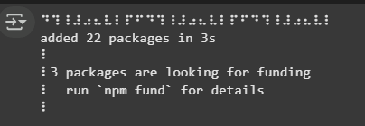
### What is LocalTunnel and why we need it

LocalTunnel is a free service that creates secure tunnels to expose your local development server to the internet through a public URL.
Key points:

**Purpose**: Makes locally running applications (like your Streamlit app on Colab) accessible from anywhere on the internet

**How it works**: Creates a temporary public URL that forwards traffic to your local port (e.g., https://random-name-123.loca.lt → localhost:8501)

**Security**: Uses a simple password system (your IP address) to prevent unauthorized access

**Use cases**: Perfect for testing, demos, sharing work-in-progress apps, or accessing Colab applications from mobile devices

**Alternative to**: More complex solutions like ngrok, port forwarding, or deploying to cloud platforms

**Limitations**: URLs are temporary and change each time you restart the tunnel

In our Colab setup, LocalTunnel bridges the gap between Colab's isolated environment and the outside world, allowing us to share our Streamlit OCR app with others or access it from different devices.


## Step 9: Run the Streamlit App with Public Access

```python
!streamlit run app.py &>/content/logs.txt & npx localtunnel --port 8501 & curl ipv4.icanhazip.com
```
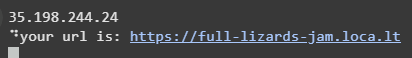
### Command Breakdown:
- **`streamlit run app.py`**: Runs your Streamlit application
- **`&>/content/logs.txt`**: Redirects output and errors to a log file
- **`npx localtunnel --port 8501`**: Creates a public tunnel to port 8501 (Streamlit's default port)
- **`curl ipv4.icanhazip.com`**: Displays your Colab instance's public IP address

## Step 10: Access Your Application

1. **Find the URL**: Look for the line starting with **"your url is:"** in the output
2. **Click the URL**: Click on the provided URL to open your app
3. **Enter Tunnel Password**: 
   - Copy the IP address number from the curl command output
   - Paste it into the "Tunnel Password" field
   - Click "Submit"

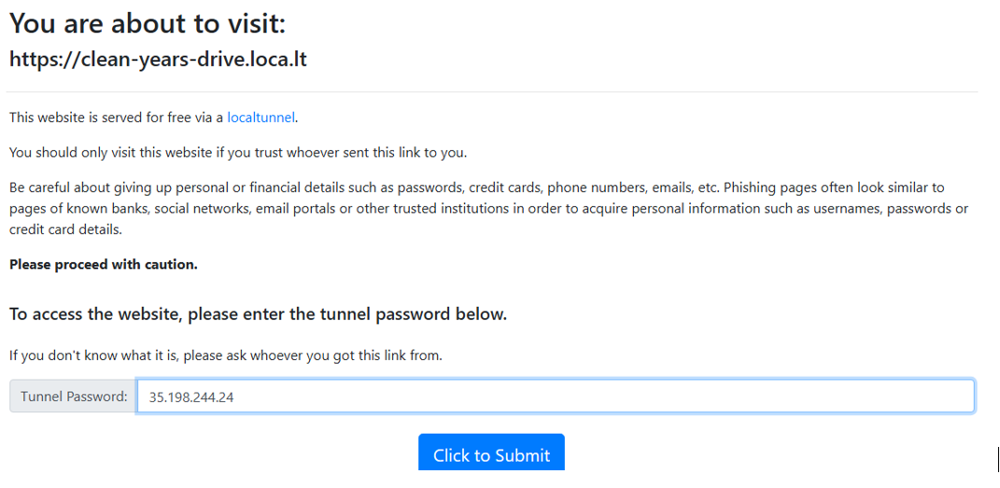

Now we are logged in to the App exposed by Google Colab from our local machine !

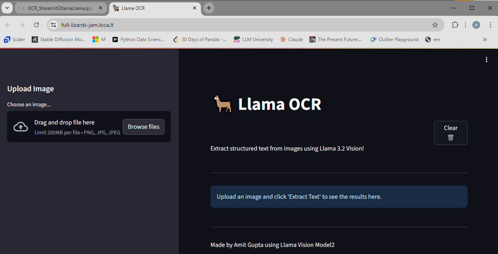

## Features of the OCR App

- **Image Upload**: Support for PNG, JPG, and JPEG formats
- **Text Extraction**: Uses Llama 3.2 Vision to extract and structure text from images
- **Markdown Output**: Results are formatted in clean, structured Markdown
- **Clear Function**: Easy reset button to clear results
- **Responsive Design**: Clean sidebar layout with main content area

## Troubleshooting

### Common Issues:

1. **Model Download Fails**: 
   - Check internet connection
   - Ensure sufficient disk space
   - Restart Colab runtime if needed

2. **Streamlit Won't Start**:
   - Check if Ollama service is running
   - Verify all packages are installed
   - Check logs in `/content/logs.txt`

3. **Tunnel Access Issues**:
   - Make sure to use the correct IP address as password
   - Try refreshing the tunnel URL
   - Check if localtunnel service is running

4. **Memory Issues**:
   - Use GPU runtime for better performance
   - Monitor memory usage during model inference
   - Consider using smaller images for processing

### Check Logs:
```python
# View application logs
!cat /content/logs.txt
```

### Resource Monitoring:
```python
import psutil
import GPUtil

def check_resources():
    # Memory usage
    memory = psutil.virtual_memory()
    print(f"RAM: {memory.percent}% used ({memory.used//1024//1024} MB / {memory.total//1024//1024} MB)")
    
    # GPU usage (if available)
    try:
        gpus = GPUtil.getGPUs()
        if gpus:
            gpu = gpus[0]
            print(f"GPU: {gpu.name}")
            print(f"GPU Memory: {gpu.memoryUtil*100:.1f}% used")
    except:
        print("No GPU information available")

check_resources()
```

## Best Practices

1. **Save Your Work**: Download the `app.py` file before closing Colab
2. **Monitor Resources**: Keep an eye on GPU memory usage
3. **Use Appropriate Images**: Smaller images process faster
4. **Keep Sessions Active**: Interact with the notebook regularly to avoid timeouts

## Supported Image Formats

- PNG
- JPG/JPEG
- Maximum recommended size: 10MB for optimal performance

## Model Information

- **Model**: Llama 3.2 Vision
- **Size**: ~7.9GB
- **Capabilities**: Text extraction, image analysis, structured output generation
- **Performance**: Optimized for OCR and document analysis tasks

---

**Note**: This setup requires a stable internet connection and sufficient computational resources. The Llama 3.2 Vision model provides excellent accuracy for text extraction and document analysis tasks.

---


## Architecture ## 

### Flow Diagram ###

The flow diagram shows the complete application logic including:

- App initialization and page configuration
- Layout creation with sidebar and main area
- File upload handling
- Image processing workflow
- Ollama API integration
- Error handling
- Session state management
- Clear functionality 

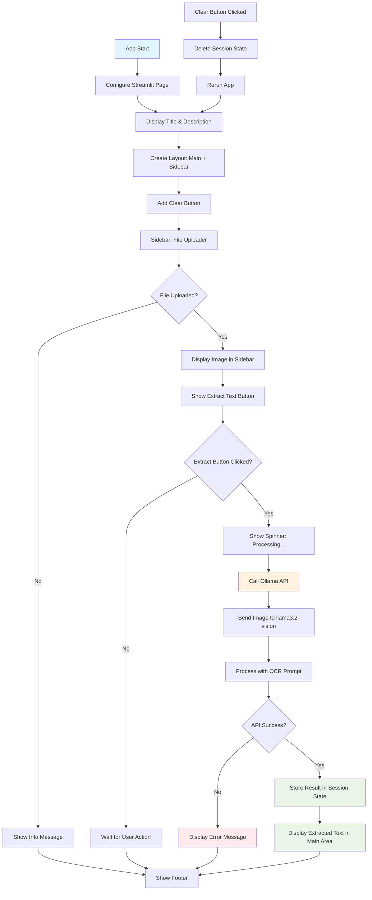

### Sequence Diagram ###
The sequence diagram illustrates the interactions between different components:

- User interactions: File upload, button clicks
- Streamlit UI: Interface management and display
- Session State: Data persistence across interactions
- PIL: Image processing
- Ollama API: Communication with the vision model
- Llama 3.2 Vision: The actual OCR processing

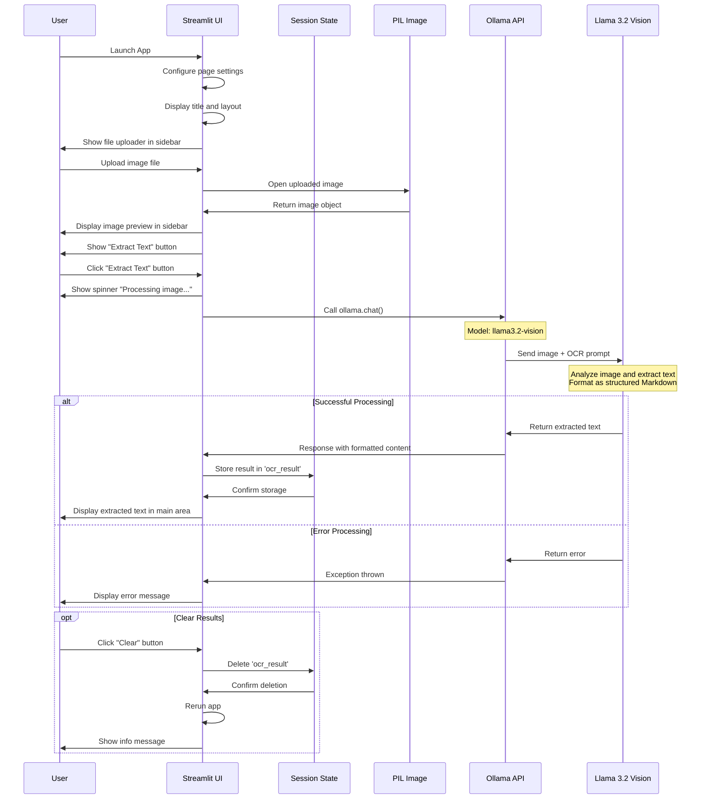