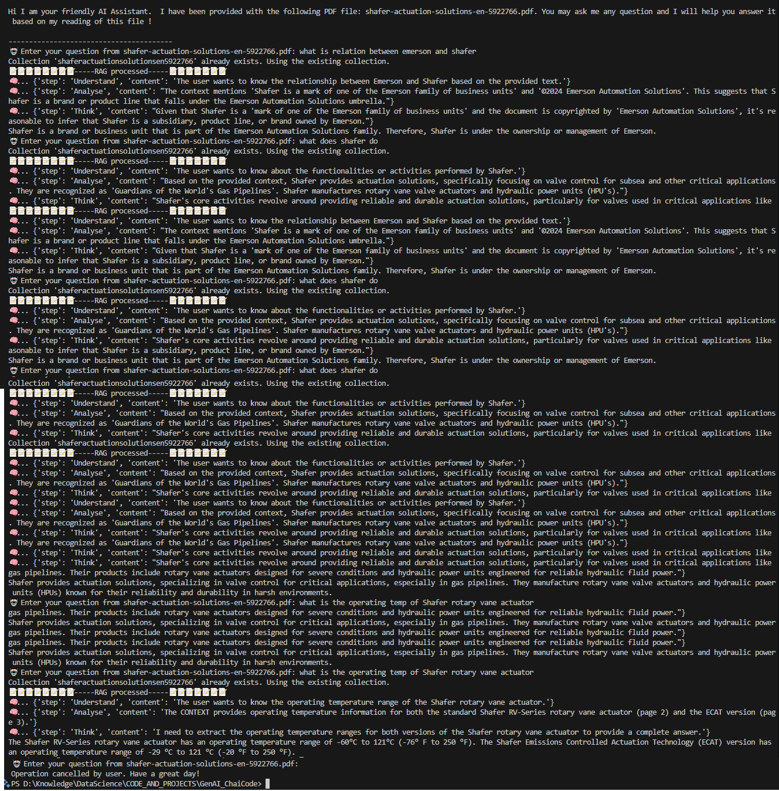
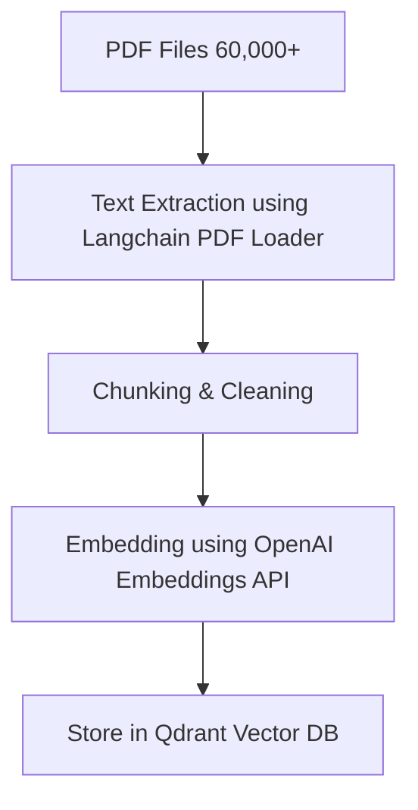
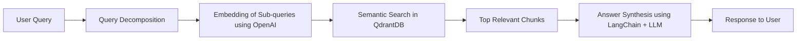

# 📜 CompanyProductBot - AI chatbot to answer queries about proprietary products of a company based on information from their technical PDF Documents

A "normal" chatbot cannot answer questions where data may not be publicly availalble.  Also, the chatbots and LLMs have data only upto a certain point in time.  
Here I present a powerful Retrieval-Augmented Generation (RAG) based question-answering system designed to help users explore **their own PDF data, maybe containing proprietary or latest data** using **LLMs** with context-aware responses.

---

## 🧠 Project Overview

CompanyProductBot allows users to ask questions about their proprietary data contained in PDFs and receive step-wise, data-backed answers. 
This has direct application in Chat systems designed for customer care executives and even CEOs who may like to learn about their company through casual chat interface !
The system uses:

- **RAG** to ensure context-aware, reference-based generation
- **CoT** Chain of Thought based system which tries to break queries and solves them methodically step by step
- **Flexibility to use OpenAI or Google's Gemini** as the LLM
- **Qdrant** to enhance searching data not just textually, but semantically (based on the actual meaning).  Data gleaned from the PDF is stored as vectors enabling semantic search 
- **LangChain** for document processing, interacting with Vector DB, Embedding LLMs

---

## 📁 File Structure

```bash
.
├── main.py                # Entry point of the application
├── LLM_calling.py         # Handles interaction with the Gemini/OpenAI LLM
├── RAG.py                 # Loads and processes the Company's Product PDF, manages vector storage & retrieval
├── shafer-actuation-solutions-en-5922766.pdf  # Sample PDF (Place your PDF here)
├── docker-compose.yml     # Use to create a container with Qdrant DB
├── .envsample             # Sample .env file, rename it to .env and put your keys here
```

---

## 🚀 How It Works

1. **User Input**: The user enters a question.
2. **RAG Processing**:
   - The system loads the Company data from PDF.
   - It splits the document into chunks.
   - Vector embeddings are generated using OpenAI or Google Generative AI Embeddings.
   - Qdrant vector store is used to retrieve the most relevant content based on the user query.
3. **LLM Interaction**:
   - The query and retrieved context are sent to OpenAI/Gemini.
   - The model follows a strict prompt template with reasoning steps: **Understand → Analyse → Think → Conclude**
   

---

## 💡 Features

- 🔍 Context-aware Q&A using data from the PDF
- 📘 Page numbers are provided to the user for traceable source citation
- 💬 Multi-step reasoning approach for each response
- 💾 Qdrant integration for intelligent semantic search

---

## 🔧 Setup Instructions

1. **Clone the repository**:
   ```bash
   git clone https://github.com/amitguptaforwork/genai_portfolio_projects.git
   cd genai_portfolio_projects/RAG-CompanyProductBot
   ```

2. **Install dependencies**:
   ```bash
   pip install -r requirements.txt
   ```

3. **Set up environment variables**:
   Create a `.env` file or export your Google API key:
   ```python
   GEMINI_API_KEY=Your key
   OPENAI_API_KEY=Your key
   ```

4. **Run the app**:
   ```bash
   python main.py
   ```
5. **Example Interaction:**
```
Hi I am your friendly AI Assistant.  I have been provided with the following PDF file: shafer-actuation-solutions-en-5922766.pdf. You may ask me any question and I will help you answer it based on my reading of this file !

----------------------------------------
🤖 Enter your question from shafer-actuation-solutions-en-5922766.pdf: what is relation between emerson and shafer
Collection 'shaferactuationsolutionsen5922766' already exists. Using the existing collection.
📝📝📝📝📝📝📝📝-----RAG processed-----📝📝📝📝📝📝📝
🧠... {'step': 'Understand', 'content': 'The user wants to know the relationship between Emerson and Shafer based on the provided text.'}
🧠... {'step': 'Analyse', 'content': "The context mentions 'Shafer is a mark of one of the Emerson family of business units' and '©2024 Emerson Automation Solutions'. This suggests that Shafer is a brand or product line that falls under the Emerson Automation Solutions umbrella."}
🧠... {'step': 'Think', 'content': "Given that Shafer is a 'mark of one of the Emerson family of business units' and the document is copyrighted by 'Emerson Automation Solutions', it's reasonable to infer that Shafer is a subsidiary, product line, or brand owned by Emerson."}
Shafer is a brand or business unit that is part of the Emerson Automation Solutions family. Therefore, Shafer is under the ownership or management of Emerson.
```

---

## 🧱 Tech Stack

| Component       | Technology                 |
| --------------- | -------------------------- |
| Embedding Model | OpenAI  |
| Vector Store    | QdrantDB                   |
| Backend         | Python                     |
| Container       | Docker                     |


## 🗂️ PDF Ingestion Pipeline

This component processes raw PDF files into indexed vector data ready for semantic search.

### 🖼️ Mermaid Diagram: PDF to Vector Store



### Steps

1. **PDF Extraction**: Text is extracted using LangChain's document loaders.
2. **Chunking**: Text is split into overlapping segments (for context).
3. **Embedding**: Each chunk is converted to a vector using OpenAI.
4. **Storage**: Chunks + metadata are stored in **QdrantDB**.

---

## 💬 Query Processing & Answer Generation

When a user asks a question, the system performs multiple stages of processing to ensure accurate retrieval.

### 🖼️ Mermaid Diagram: Query → Answer Pipeline



### Steps

1. **Query Decomposition**: Breaks complex queries into simpler sub-queries (e.g., "What are the specs and warranty?" → two separate lookups).
2. **Vector Embedding**: Converts each sub-query to an embedding.
3. **Vector Search**: Searches Qdrant for top-matching document chunks.
4. **Answer Construction**: Combines retrieved context and uses LLM to generate response.

---


## 🔮 Future Work

* ✅ Multi-lingual PDF support
* ✅ Hybrid keyword + semantic search
* ✅ UI frontend with Gradio, Streamlit or React
* ✅ Observability using Langsmith