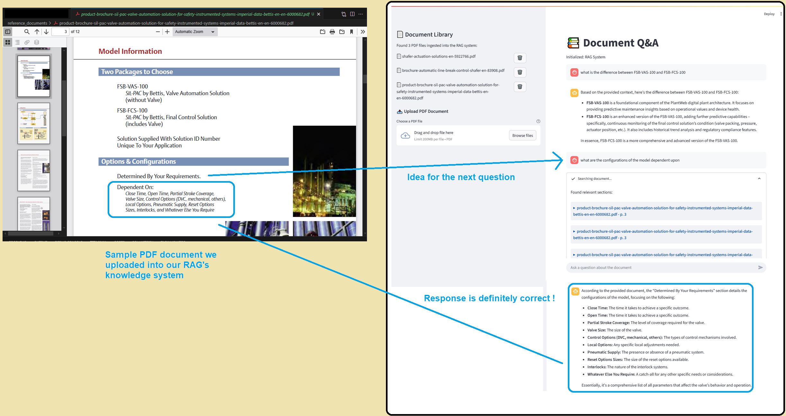
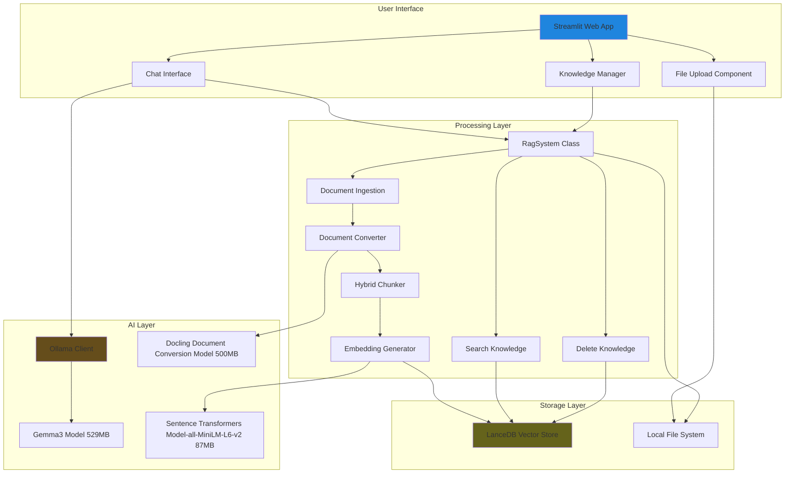
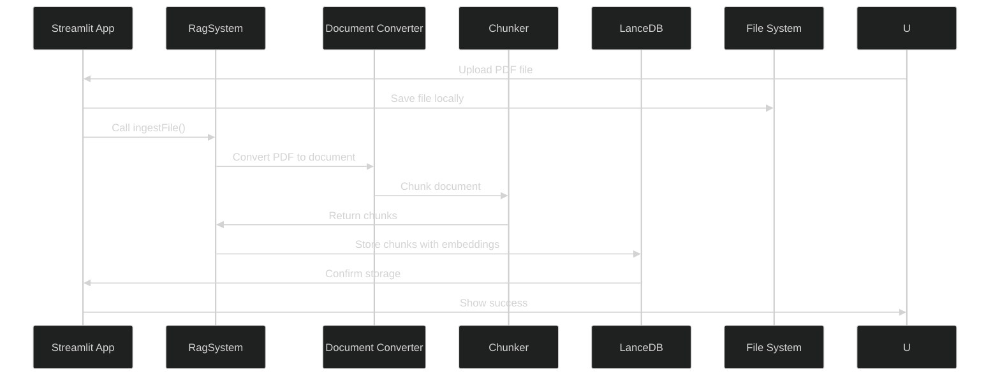
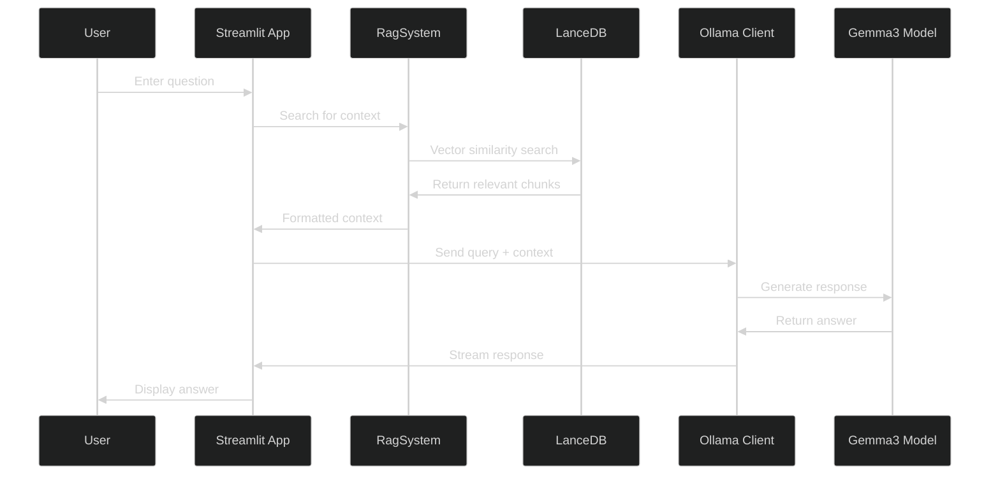
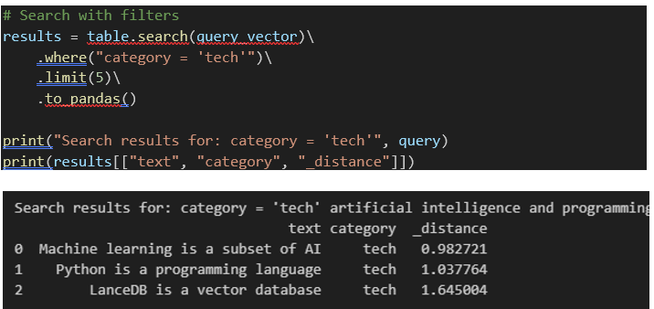
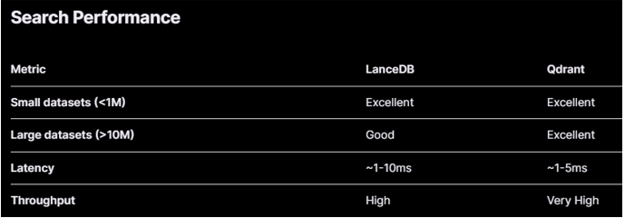
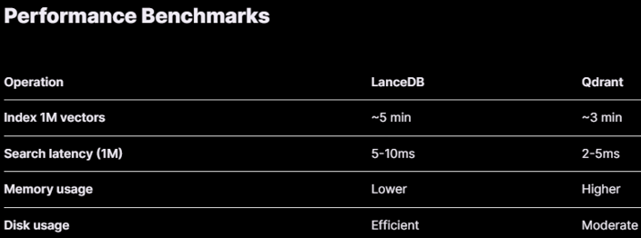
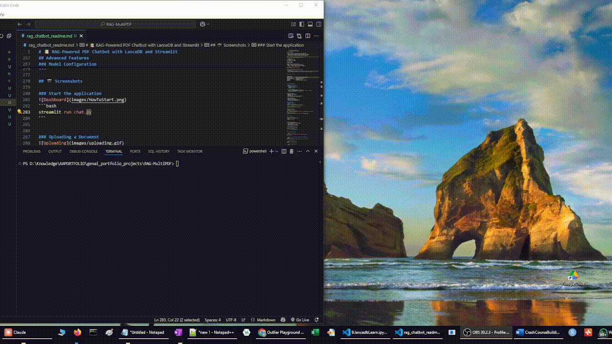
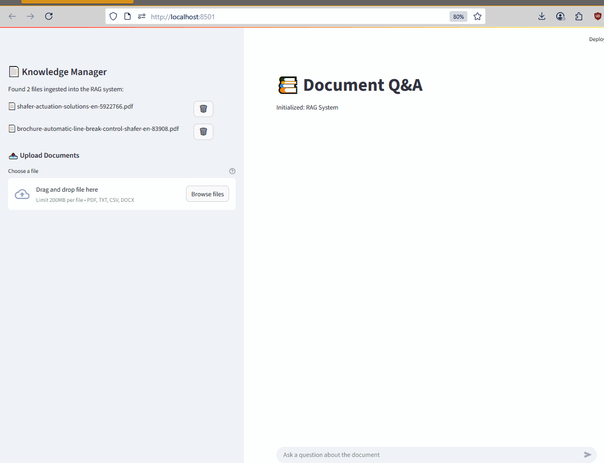
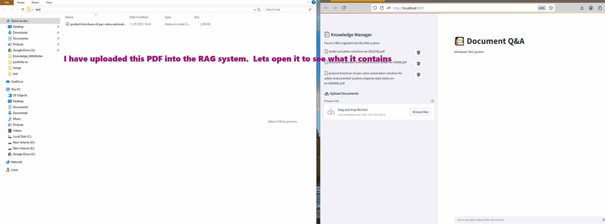

# 📚 RAG-Powered PDF Chatbot with LanceDB and Streamlit -works completely offline !

I created a completely offline RAG system in this project.  Well, what does that even mean !

### What is RAG System
A RAG system is a AI Chatbot whose knowledge has been enhanced with some proprietary data of your choice so that your chatbot can answer questions based on that knowledge, which it otherwise does not have access to.  For example, in this project, I had some product manuals and I fed those into the RAG system.  Once done, now my RAG system makes that knowledge available to me through an easy-to-use chatbot 

Internally RAG system uses a `vector database` to store data. This database is special though.  Instead of storing just text, it stores "meanings" of the text (called semantics).  And these special databases then allow us to search based on meaning of the query, rather than just _words_ in the query. Now when a user query comes, we convert it into its equivalent embedding, then search document chunks from the knowledge system that match the given query, and send all this to our `LLM` which processes all the information, and gives a nice human-understandable output.

Diagram courtesy https://www.dailydoseofds.com

### What is a Offline System
In a typical chatbot setup, you would use services like OpenAI or Gemini to chat.  But this means your data needs to go out of your system, to the Internet, where it may be stored by these providers for their own training, and then returns back.  This could be an issue if you dont want your data to go to Internet.

In my project, the data never leaves your computer.  I just use Internet to download the two machine learning models needed, and after that Internet is not required.

I run these models on my consumer hardware machine (AMD Ryzen 7 5700G with Radeon Graphics,3.80 GHz) and 32GB RAM.  There is no GPU used (the inbuilt GPU in Ryzen 5700G is not available to us :(, most ML code is right now targeted to Nvidia gpus )

### What does the application do
This app allows one to:

✅ Upload PDF documents and add them to the knowledge system.  :`Tech stuff: This knowledge database is using the LanceDB vector database`

✅ Ask questions about your documents and get precise answers with citations.  `Tech stuff: The RAG system queries the knowledge system and retrieves sections from it that are relevant to the query.  Then the query and these relevant knowledge is sent to an LLM so that a nice coherent response can be created for the user`

✅ Manage your library by deleting documents from the vector store.`Tech stuff: We can update our knowledge database to delete information from it`

Here is a screenshot of the system that shows on the left side, the three documents that we have put in our knowledge system.  We can see how the chatbot is now able to answer queries that are very very specific to the information that is only contained in the documents.




---

## 🚀 Features

- 📥 **Upload PDFs:** Drag and drop PDFs and process them on the fly.
- 🤖 **Chat with PDFs:** Ask questions and get context-aware answers.
- 🗑️ **Delete PDFs:** Remove specific documents from the vector store.
- 💾 **LanceDB Integration:** Fast, scalable vector database for embeddings.
- 🧠 **Local LLM Support:** Uses Ollama to run models like `gemma3:1b` locally.

---

## 🛠️ Architecture Overview


---

## 📜 Sequence Diagram

### Document Upload Flow



### Chat Query Flow


---

## 🧑‍💻 How It Works - Code Walkthrough

Here’s a quick peek at how the core parts work:

The heart of the application is the RAG class that handles document processing, vector storage, search and even deletion of knowledge:

### RAG System Core (RagSystem.py)
```python
from docling.chunking import HybridChunker
from docling.document_converter import DocumentConverter
from sentence_transformers import SentenceTransformer
import lancedb

class RAG:
    def __init__(self):
        self.db = lancedb.connect("data/rag_MyCompany")
        self.table = self.db.create_table("products", schema=Chunks, mode="overwrite")
```
Key Features:

- Automatic Database Management: LanceDB is installed locally.  It manages the data using files.  We connect to the local system
- Schema Definition: LanceDB says that if you specify the data using pydantic model, then I can allow you to simply specify which field to use for generating embeddings on and which field to use to store the embeddings.  
- Vector Embeddings: When we add data, LanceDB automatically generates embeddings using sentence-transformers model that sits locally in our machine.

### Document Ingestion Pipeline (RagSystem.py)

```python
def ingestFile(self, pdfPath):
    # Extract content from PDF
    converter = DocumentConverter()
    result = converter.convert(pdfPath)
    
    # Apply intelligent chunking
    chunker = HybridChunker()
    chunk_iter = chunker.chunk(dl_doc=result.document)
    chunks = list(chunk_iter)
    
    # Process chunks for storage
    processed_chunks = [
        {
            "text": chunk.text,
            "metadata": {
                "filename": chunk.meta.origin.filename,
                "page_numbers": [...],  # Extract page numbers
                "title": chunk.meta.headings[0] if chunk.meta.headings else None,
            },
        }
        for chunk in chunks
    ]
    
    # Store in vector database
    self.table.add(processed_chunks)
```
What happens here:

- Document Conversion: We are using industry leading open source library called Docling (developed by IBM) for document parsing.  It is extracting text and structure from PDF
- Hybrid Chunking: Intelligently splits content preserving context.  Docling has out of the box support for popular chunking algorithms (so no need to use a separate library like langchain for that).  Hybrid chunking is basically hierarchical chunking which is considered pretty good in the chunking world. 
- Metadata Extraction: Captures filename, page numbers, and titles. Docling shines here.  It can extract very detailed information.
- Vector Storage: Automatically generates and stores embeddings in LanceDB 

### 💬 Streamlit Interface for creating Chatbot (chat.py)
The user interface provides seamless interaction:

```python
import streamlit as st
from RagSystem import RAG
from ollama import Client

ragSystem = RAG()
client = Client()

query = "What is this document about?"
context = ragSystem.table.search(query).limit(5)
response = client.chat(model="gemma3:1b", messages=[
    {"role": "system", "content": f"Context: {context}"},
    {"role": "user", "content": query}
])
print(response['message']['content'])
```

This is a over simplified version of actual code.
In actual code 
- we use @st.cache_resource prevents re-initialization of heavy objects like ragSystem and client
- we use get_context to query the table, and format the results for citation (links to documents that were considered to arrive at the answer are shown in the chatbot)

---

## 📊 Technical Details

### Architectural Decisions
As an architect, we must understand why we are using a particular tool.  Here I am giving a brain-dump of knowledge I collected and assimilated while creating this project.

### Document Parsing - Docling and alternatives

[Docling](https://github.com/DS4SD/docling) is a open source document processing library that converts various document formats into a unified format. It has advanced document understanding capabilities powered by state-of-the-art AI models for layout analysis and table structure recognition.

The whole system runs locally on standard computers. It's particularly useful for tasks like enterprise document search, passage retrieval, and knowledge extraction. 

The library also gives out of the box support for advanced chunking capabilities, maknig it a good tool for GenAI applications like RAG (Retrieval Augmented Generation) pipelines.


I also had option to use unstructured.io.
Both these are very capable libraries, each uses a local ML model for their working.

I experimented with both, more or less they are similar.  Some online resources suggested that docling is faster and I experienced it too.  
https://dev.to/aairom/my-first-hands-on-experience-with-docling-46mi
- Processing Speed:
	- Docling: Moderate speed with linear scaling (6.28s for 1 page, 65.12s for 50 pages) 
	- Unstructured: Significantly slower (51.06s for 1 page, 141.02s for 50 pages) 
	- Without GPU support, Docling leads with 3.1 sec/page (x86 CPU) and 1.27 sec/page (M3 Max SoC) docling-parse·PyPI

Also unstructured.io seems to have some bugs when I tried to experiment with some standalone code.  They have both open-source and commercial API solutions and maybe their focus is more on the codebase of commercial one.

I found the architecture of Docling to be much more understandable to me (I dont like too much abstraction). Docling converts ANY document to an internal representation that they called docling doc and then the same can be converted into any of the required formats.  So parsing is required only once.  See this image.


Also another very cool thing is that we dont have to explicitly use different functions for different document types (.PDF, DOCX, PPTX, XLSX, HTML, WAV, MP3, images (PNG, TIFF, JPEG,..)).  It automatically detects and parses different file types. We just use the `converter.convert` method.  One limitation I found though: it seems they are not supportin parsing text files right now out of the box, so [some hacking required there by reading the .txt as a .md file!](https://github.com/docling-project/docling/discussions/1145)


### Vector Database - LandeDB and Alternatives
LanceDB is an open-source, serverless vector database that's designed for AI applications. It's built on Lance, a columnar data format optimized for machine learning workloads.

I also had option to use Qdrant DB, which is another great open source alternative.  
I have worked with Qdrant DB in the past, wherein I deployed it as a docker container
We interact with it using APIs (via packages in python)

LanceDB, on the other hand, simply runs as a embedded database.  Its lightening fast.

The reason to chose LanceDB was simply that I wanted to explore it.  Having said that, there are indeed some differences between the two.

### LanceDB vs Qdrant: Vector Database Comparison

LanceDB and Qdrant are both vector databases, but they have different architectures and use cases:

#### LanceDB

- Built on Apache Arrow and Lance columnar format
  - Columnar is More Beneficial for Certain Use Cases
    1. Analytical Query Performance
      ```
      Lance (Columnar):
      - Scanning price column: reads only price data
      - GROUP BY category: efficient column scanning
      - Aggregations: vectorized operations

      Qdrant (Row-oriented):
      - Must read entire records even for single column analysis
      - Less efficient for analytical operations
      ```
      Here is a concrete example

      

    2. Compression Efficiency
        - Lance: Similar values in columns compress better (e.g., all prices together)
        - Qdrant: Mixed data types in rows don't compress as well
    3. Memory Efficiency
        - Lance: Load only needed columns into memory
        - Qdrant: Loads full records even if you only need metadata
    4. Integration with Analytics Tools
    ```python
    # Lance/LanceDB - seamless integration
    df = lance_table.to_pandas()
    df.groupby('category').agg({'price': 'mean'})
    # Qdrant - requires data transformation
    results = qdrant_client.scroll()
    # Convert to DataFrame, then analyze
    ```
    5. Vectorized Operations
        - Lance: Leverages Arrow's SIMD optimizations for bulk operations
        - Qdrant: Optimized for individual vector operations
- Designed for analytical workloads with vector search capabilities
- Serverless-first architecture with embedded options
  - 'Embedded' - What it means:
    - Database can run directly within your application process
    - No separate database server required
    - Database files are stored locally with your application
    - Similar to SQLite's embedded approach

- Strong integration with data science workflows (pandas, polars, etc.)
- Better for scenarios where you need both vector search and analytical .  
  - Analytical queries are queries that compute aggregations (count, average,sum), statistics (percentile, StDev, moving averages), or perform complex data analysis operations - as opposed to simple lookups or point queries.
  - LanceDB excels at these because:
    - Columnar storage format is optimized for scanning large datasets
    - Native integration with analytical tools (pandas, DuckDB, etc.)
    - Can efficiently process millions of rows for aggregations
    - Supports both vector similarity AND traditional SQL-like operations
- Supports both in-memory and disk-based storage
- Native support for multimodal data that allows you to store and query different data types 
  - LanceDB supports multimodal search by indexing and querying vector representations of text and image data
  - This enables efficient retrieval of relevant documents and images using vector-based similarity search. 
  - The platform facilitates cross-modal search, allowing for text-image and image-text retrieval
  - See examples https://lancedb.github.io/lancedb/examples/python_examples/multimodal/
- More focused on data lakehouse patterns

#### Qdrant

- Purpose-built vector database optimized specifically for similarity search
  - Qdrant uses a row-oriented storage with custom optimizations:
    - HNSW (Hierarchical Navigable Small World) graphs for vector . HNSW is highly optimized for similarity search
    - Segment-based architecture - data organized in segments for efficient retrieval
    - Custom binary format optimized for vector similarity search
    - Payload storage separate from vector storage
- Rust-based for high performance and memory efficiency
  - Faster for pure vector retrieval operations
  - Row storage is more efficient for complete record retrieval
  - Better for real-time similarity queries
  
- More mature with extensive filtering and payload support
- Better horizontal scaling capabilities
  - Proven performance at scale
  - 
- Rich query language with complex filtering options
- Strong focus on production vector search workloads
- More established ecosystem and community

#### When to Choose LanceDB

- You need to combine vector search with analytical queries
- You want to do multimodal search
- Working heavily with data science tools and workflows
- Want a serverless or embedded solution
- Dealing with large-scale data that benefits from columnar storage


#### When to Choose Qdrant

- Pure vector search is your primary use case
- Need advanced filtering and query capabilities
- Require proven scalability for production workloads
- Want a mature, specialized vector database

#### Conclusion

Both are good choices, but LanceDB is better for analytical + vector workloads while Qdrant excels at pure vector search scenarios.

### Specifying Storage Schema for automatic embedding
One nice feature in LanceDB is that the library can automatically generate embeddings for us.
See, typically a embeddling library provides a direct method to generate embedding for a giving field.
But it is manual work and we may not be able to do it optimally (parallelly generate embeddings for multiple records)

LanceDB provides a automated approach to this.
We first define what is called a registry and specify the model to use 
```python
# Get the sentence-transformers function from registry
from lancedb.embeddings import get_registry
func = get_registry().get("sentence-transformers").create(name="all-MiniLM-L6-v2")

```
Now we specify a schema that represents the record we intend to add to our VectorDB, using the usual pydantic framework.  

```python
class ChunkMetadata(LanceModel):
    filename: str | None
    page_numbers: list[int] | None
    title: str | None

class Chunks(LanceModel):
    text: str = func.SourceField()  # Original text
    vector: Vector(func.ndims()) = func.VectorField()  # 384-dim embeddings
    metadata: ChunkMetadata  # Rich metadata
```
The magic happens here.  The line `text: str = func.SourceField()` marks the text field as the source for embedding generation.  When we insert data, LanceDB will automatically generate embeddings from this field.

`func.VectorField()` specifies that this field is to be used to store the vector embeddings generated from the source field


### Embedding Model
- Model: all-MiniLM-L6-v2
- Size on Disk - 87 MB
- Deployment: Local inference
- Dimensions: 384
- Performance: Fast inference with good quality
- Use Case: Optimized for semantic search

### LLM Integration
- Model: Ollama Gemma3:1b
- Size on Disk - 529 MB
- Deployment: Local inference
- Privacy: No data leaves your machine
- Customizable: Easy to swap models


## Advanced Features
### Document Management:
```python
# Get all ingested documents
documents = ragSystem.getUniqueDocumentsIngested()

# Delete specific document
ragSystem.deleteFile("document_name.pdf")
```

### Model Configuration
To use different models:
```python
# For different embedding models
func = get_registry().get("sentence-transformers").create(name="your-model-name")
****
# For different **LLMs**
response = client.chat(model="your-model-name", messages=messages)
```
---

## 📸 Screenshots

### Start the application

```bash
streamlit run chat.py
```


### Uploading a Document

- Click "Choose a file" in the sidebar
- Select your file
- Click "Save to Reference Folder"
- Wait for ingestion to complete

### Chatting with a PDF



---

## ⚙️ Installation & Setup
 - Skipping this section as this repo is not designed to be cloned.  It's a actual project.  I am just sharing my learning through this git repo.  Contact me if you need help to setup a similar system at your end.

---

## 📦 Technical Stack
- [LanceDB](https://lancedb.github.io/) for blazing-fast vector storage.
- [Ollama](https://ollama.com/) for privacy-first local LLMs.
- [Streamlit](https://streamlit.io/) for interactive web apps.
- [Sentence Transformers](https://www.sbert.net/) for embedding magic.
- [Docling](https://github.com/docling-project/docling) for OCR and ML-based document parsing and chunking
---

## 📜 License
This is proprietary development.  Contact me if you need help to setup a similar system at your end.

---


## 📞 Contact
For questions, reach out to [amitguptaforwork@gmail.com](mailto:amitguptaforwork@gmail.com).

---

🎉 **Start chatting with your PDFs today!**

